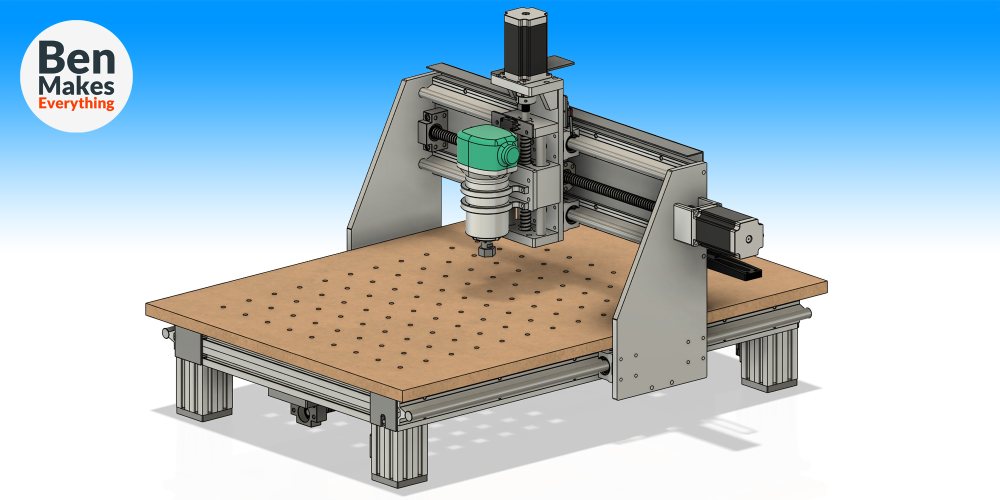
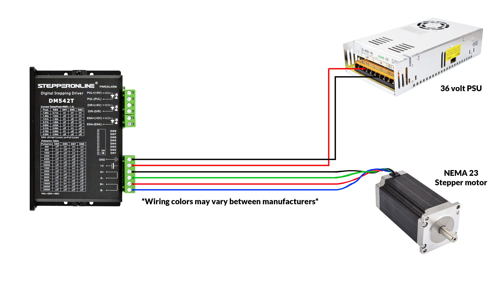
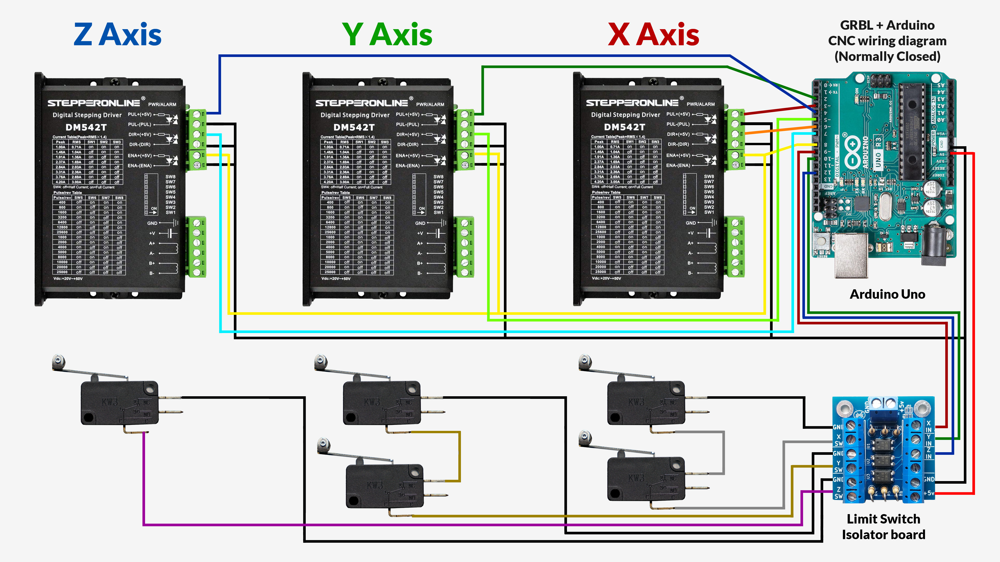

# Ben's CNC Machine V1
This folder hoses the files and info about my CNC machine which I have made 2 videos aboust on YouTube.
* The main video about this project can be found here: https://www.youtube.com/watch?v=covhU4L5N5g
* And a follow-up video with more info can be found here: https://www.youtube.com/watch?v=nlWXileUSbU

# Parts list
* Coming Soon!

# Electronic Schematics

 
# 3D Models
* Check the main folder. If you want a different format or more info, feel free to comment on either video and I will try to add it here if I am able.
* .f3z - Fusion360 file
* .step
* .obj

# Enjoy!
